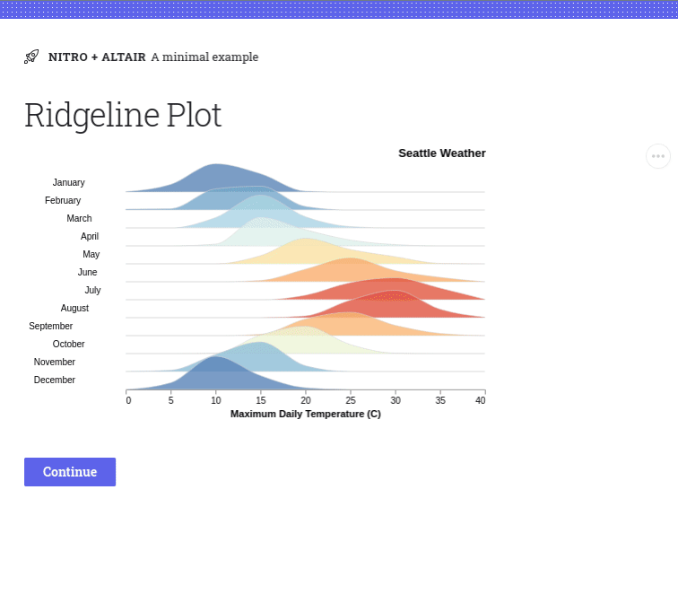

# Altair plugin for H2O Nitro

This plugin lets you use [Altair](https://altair-viz.github.io/index.html) visualizations in
[Nitro](https://github.com/h2oai/nitro) apps.

## Demo

[View source](example).



## Install

```
pip install h2o-nitro-altair
```

## Usage

1. Import `altair_plugin` and `altair_box` from `h2o_nitro_altair`.
2. Add `altair_plugin()` to your Nitro app.
3. Use `altair_box(chart)` to render Altair charts.


```py 
import altair as alt
from vega_datasets import data

from h2o_nitro import View, web_directory
from h2o_nitro_altair import altair_plugin, altair_box


def main(view: View):
    view(altair_box(make_plot()))


nitro = View(
    main,
    title='Nitro + Altair',
    caption='A minimal example',
    plugins=[altair_plugin()],  # Include the Altair plugin
)

def make_plot():
  return alt.Chart(data.cars()).mark_point().encode(
      x='Horsepower',
      y='Miles_per_Gallon',
      color='Origin',
  ).interactive()

```

## Advanced Usage

You can pass [Vega Embed Options](https://github.com/vega/vega-embed#options) to `altair_box()` for
more control.

Example:

```py
altair_box(chart, options=dict(renderer='svg', scaleFactor=2))
```

