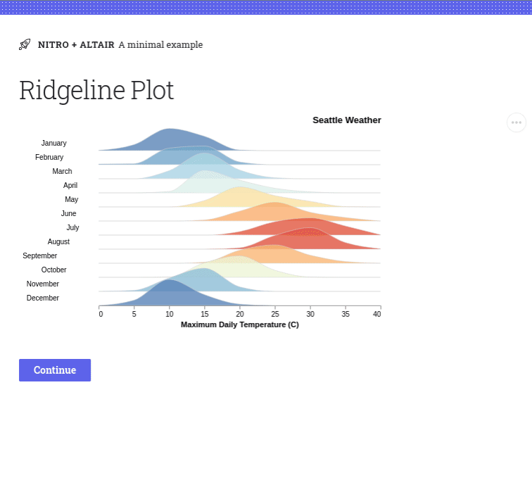

# H2O Nitro Altair Plugin Sample App

## Try it out!

```
$ wget https://raw.githubusercontent.com/h2oai/nitro-altair/main/example/app.py
$ wget https://raw.githubusercontent.com/h2oai/nitro-altair/main/example/requirements.txt
$ python3 -m venv venv
$ ./venv/bin/activate
(venv) $ pip install -r requirements.txt
(venv) $ python app.py
```



